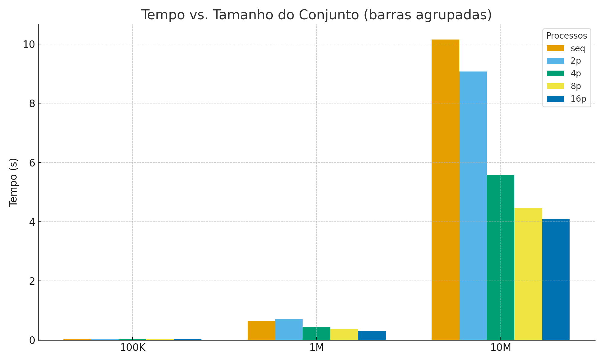
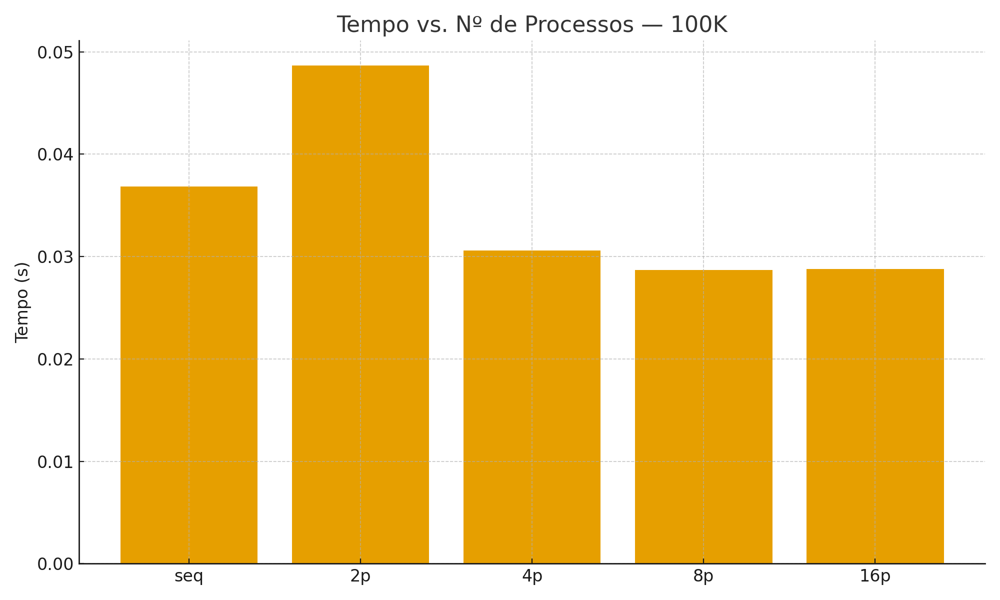
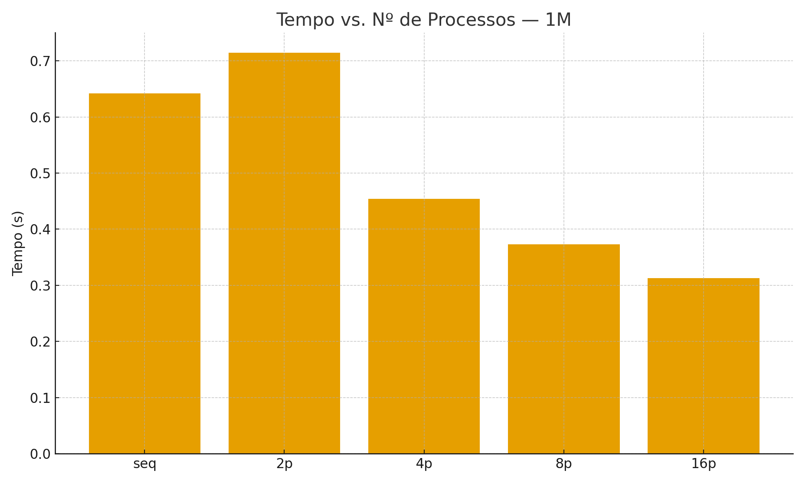
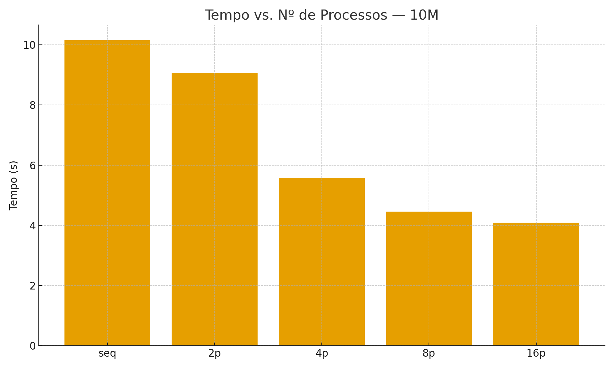
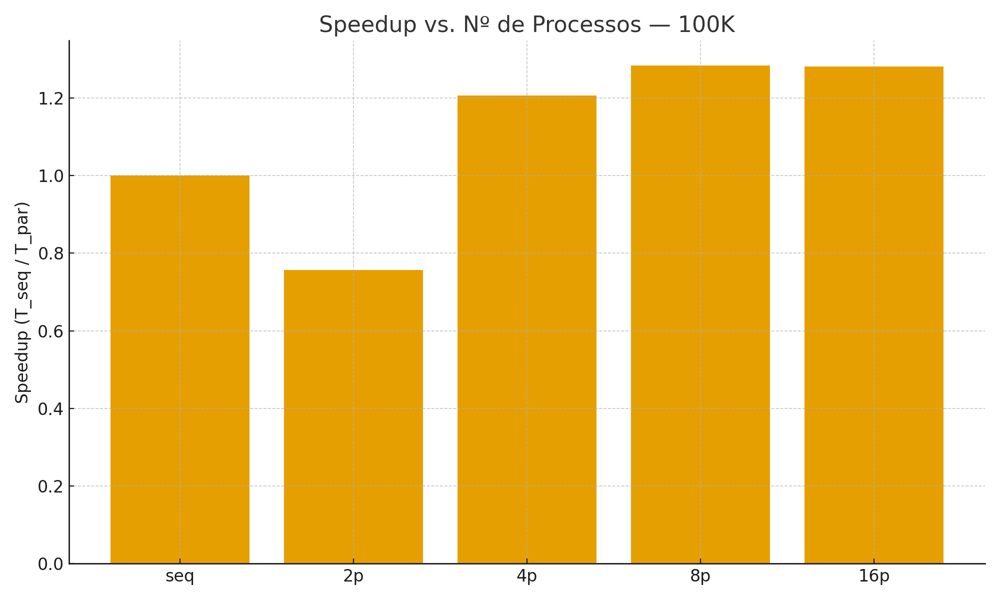
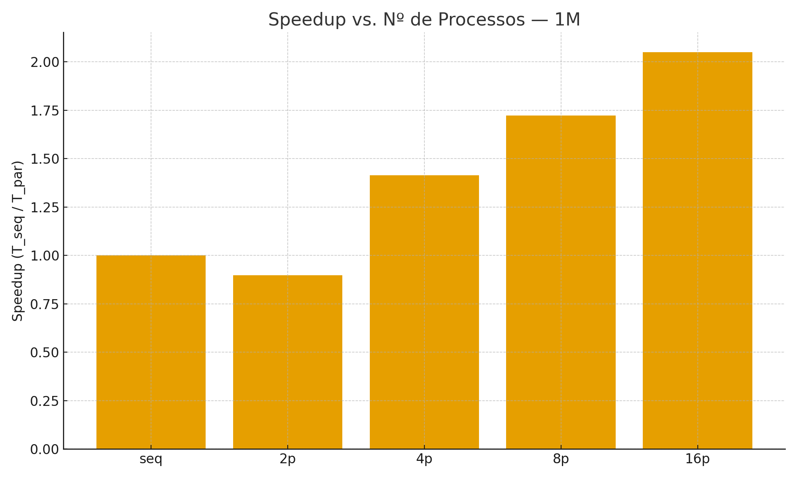
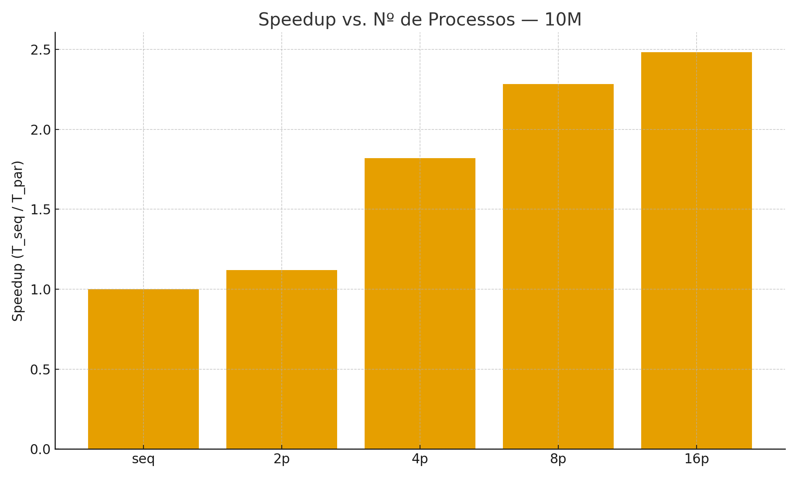

# Ordenação de Grandes Volumes de Dados Genômicos usando MPI
Este trabalho tem como objetivo implementar e avaliar estratégias de ordenação de sequências genômicas, comparando uma solução sequencial com outra paralela desenvolvida com MPI (message Passing Interface) e implementada em C/C++.

**Para gerar os datasets:**  

```sh
g++ generate_datasets.cpp -o gen_dna
```
```sh
# 100 mil sequências
./gen_dna 100000 100k.txt
 
# 1 milhão de sequências
./gen_dna 1000000 1M.txt

# 10 milhões de sequências
./gen_dna 10000000 10M.txt
```
**Compilar e executar algoritmo sequencial**
```sh
g++ seq_sorting.cpp -o seq_sort

# ordenar 100 mil
./seq_sort 100k.txt 100k_sorted_seq.txt

# ordenar 1 milhão
./seq_sort 1M.txt 1M_sorted_seq.txt

# ordenar 10 milhões
./seq_sort 10M.txt 10M_sorted_seq.txt
```
**Compilar e executar algoritmo paralelo**
```sh
mpic++ -O3 -march=native -funroll-loops -o main.cpp phases.cpp par_sort

# ordenar 100 mil p = 2
mpirun -np 2 ./par_sort 100k.txt 100k_sorted_par2p.txt

# ordenar 1 milhão p = 2
mpirun -np 2 ./par_sort 1M.txt 1M_sorted_par2p.txt

# ordenar 10 milhões p = 2
mpirun -np 2 ./par_sort 10M.txt 10M_sorted_par2p.txt

# ordenar 100 mil p = 4
mpirun -np 4 ./par_sort 100k.txt 100k_sorted_par4p.txt

# ordenar 1 milhão p = 4
mpirun -np 4 ./par_sort 1M.txt 1M_sorted_par4p.txt

# ordenar 10 milhões p = 4
mpirun -np 4 ./par_sort 10M.txt 10M_sorted_par4p.txt

# ordenar 100 mil p = 8
mpirun -np 8 ./par_sort 100k.txt 100k_sorted_par8p.txt

# ordenar 1 milhão p = 8
mpirun -np 8 ./par_sort 1M.txt 1M_sorted_par8p.txt

# ordenar 10 milhões p = 8
mpirun -np 8 ./par_sort 10M.txt 10M_sorted_par8p.txt
```
## Resultados (gráficos)










